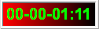

# FrameTimer - Frame Timer
- trivial demo : frame timer for record screen.

## usage
- frame timer.

## download

[Release](https://github.com/JetDemo/FrameTimer/tree/master/bin "Release")

## changelog
### [0.000.01] - 2017-08-24
#### init
- init
- bg57iv3 & jetmeta
